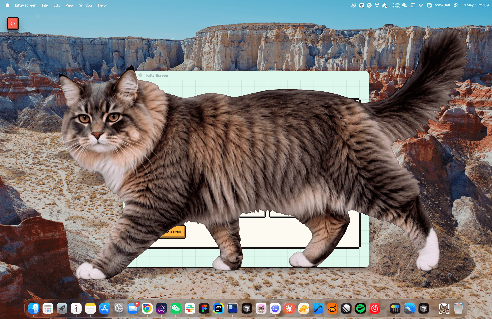
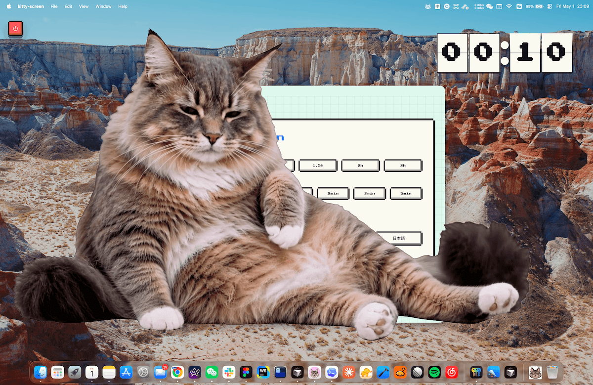

# Kitty Screen

[中文说明](README.zh.md) · [GitHub](https://github.com/elliothux/kitty-screen) · [Download](https://github.com/elliothux/kitty-screen/releases)

Kitty Screen is a Tauri + React screen saver app that displays a cat animation as a screen-blocking overlay. It activates after the screen has stayed on continuously for the configured amount of time, helping interrupt long uninterrupted screen sessions.

The animation asset is produced from green-screen cat footage, then converted into transparent WebM files for the app.

<p align="center">
  
</p>

## Preview

<p>
  
  
</p>

## Download

Download the latest app build from [GitHub Releases](https://github.com/elliothux/kitty-screen/releases).

## Prompt Templates

Reusable prompts for image and video generation live in [PROMPTS.md](PROMPTS.md).

Use that file when generating a new cat identity or rebuilding the screensaver animation sequence.

## Asset Generation Workflow

### 1. Collect Cat Reference Images

Start with high-resolution photos of the target cat.

Recommended coverage:

- Front-facing face close-up.
- Left and right side profiles.
- Full-body standing or walking pose.
- Sitting pose.
- Lying or relaxed pose.
- Clear photos of coat markings, paws, tail, eyes, and fur length.

The image model should use these photos as the identity reference. The goal is to preserve the same cat across all generated frames.

### 2. Generate Green-Screen Keyframes With GPT Image

Use GPT Image to generate an ordered keyframe sequence for the cat.

Reference sequence:

- Use `assets/raw-furryball/001.png` through `assets/raw-furryball/012.png` as action and pose references.
- Use the new cat photos only as the identity reference.
- The action references should control pose, camera angle, body placement, and animation timing.
- The new cat photos should control face, coat color, markings, body shape, fur length, paws, tail, and overall identity.

Output convention:

```text
assets/raw-<cat-name>/001.png
assets/raw-<cat-name>/002.png
...
assets/raw-<cat-name>/012.png
```

Each generated frame should use a flat `#00ff00` green-screen background with no shadows, floor, gradients, props, text, UI, or other animals.

See [PROMPTS.md](PROMPTS.md) for the full reusable prompt.

### 3. Generate the Video With an AI Video Tool

Use any AI video generator that supports first/last-frame or ordered keyframe guidance, for example Kling AI. Upload the ordered green-screen keyframes and generate a continuous cat video.

Recommended output:

- 16:9 video.
- Locked camera.
- Same cat identity for the full clip.
- Uniform green-screen background for the full clip.
- Slow entrance, stop, crouch, and final settled blocking pose.
- No camera zoom, pan, tilt, tracking, room background, text, UI, shadows, props, or extra animals.

Save the generated videos to:

```text
assets/kitty.mp4
assets/kitty-loop.mp4
```

`kitty.mp4` is the full animation. `kitty-loop.mp4` is the shorter loop/idle segment used by the app after the main entrance animation.

### 4. Remove the Green Background With FFmpeg

Use the existing conversion script:

```bash
bun run videos
```

This runs [scripts/green-screen-to-webm.mjs](scripts/green-screen-to-webm.mjs), which:

- Reads `assets/kitty.mp4` and `assets/kitty-loop.mp4`.
- Uses FFmpeg `chromakey` to remove the green background.
- Applies green despill.
- Writes alpha-enabled WebM files to `src/assets/kitty.webm` and `src/assets/kitty-loop.webm`.
- Verifies the output alpha channel with `ffprobe`.

If the generated green-screen color is not close to the script's current key color, update the `keyColor`, `similarity`, and `blend` constants in `scripts/green-screen-to-webm.mjs`.

## Development

Install dependencies:

```bash
bun install
```

Run the web app:

```bash
bun run dev
```

Run the Tauri app:

```bash
bun run app:dev
```

Build:

```bash
bun run build
```
